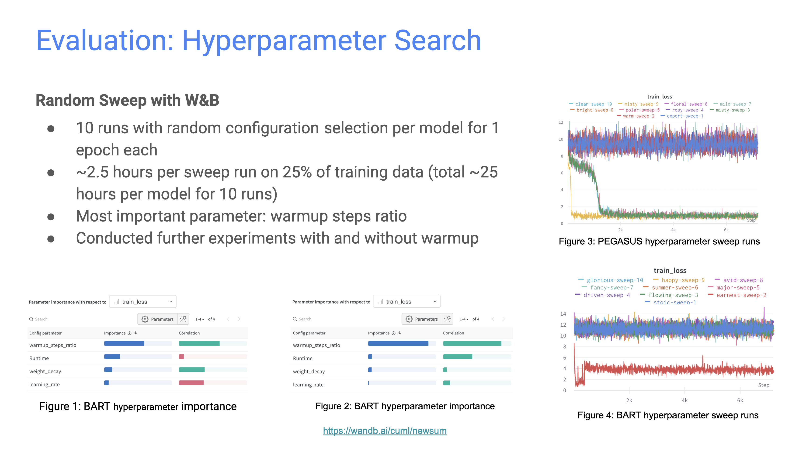
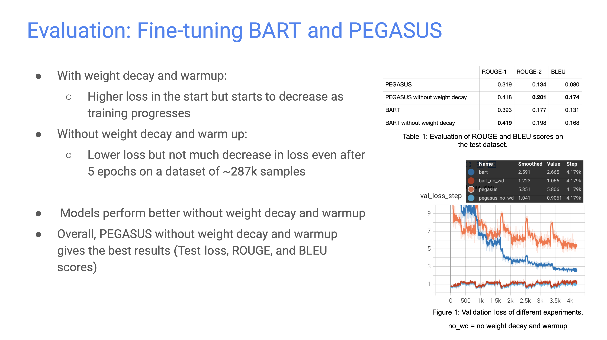
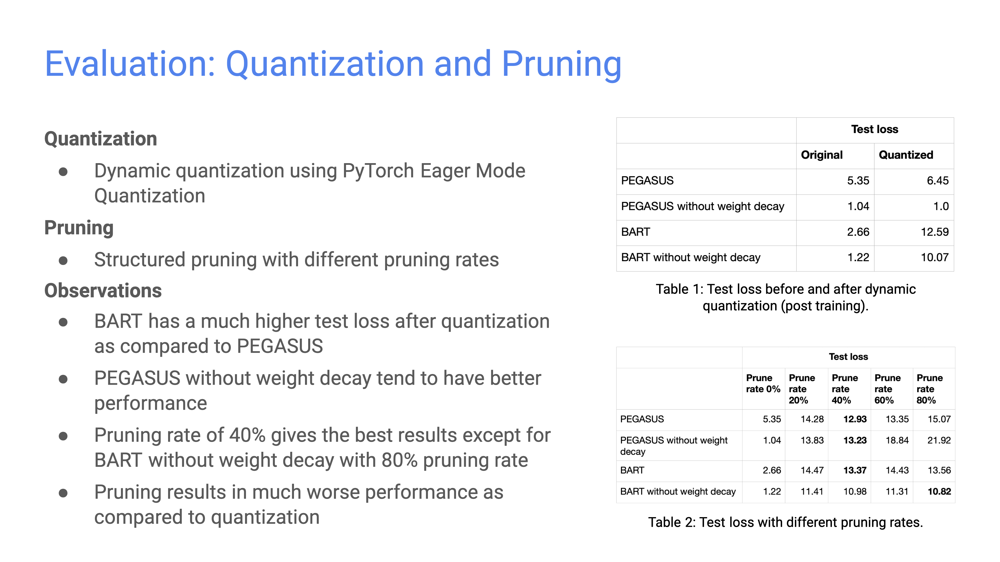

# NewSum - News Summarization using Enhanced Content Features

This repository contains source code for various experiments to explore the feasibility of using enhanced content features such as news category and named entities to improve the quality and coherence of generated news summaries.

## Motivation

Online news reading has become one of the most popular ways to consume the latest news. News aggregation websites such as Google News and Yahoo News have made it easy for users to find the latest news and provide thousands of news stories from hundreds of news publishers. As people have limited time, reading all news articles is not feasible. The success of zero-shot and few-shot prompting with models like GPT-3 has led to a paradigm shift in NLP. So, in the era of ChatGPT, we we conducted experiments using various large language models (LLMs) such as BART and PEGASUS to improve the quality and coherence of the generated news summaries.

## Project Outline

This project explores the feasibility of using additional content features such as news headline, topic modeling, named entities, and sentiment analysis to generate targeted summaries that are concise and informative. By incorporting these content features, our approach can effectively identify the most important information and key insights from a large amount of text, and present that in a way that is easy to digest for the readers. Additionally, our method allows for a more personalized and tailored summary that is specific to the interests and needs of the audience, making it more engaging and effective. Overall, our approach aims to provide a comprehensive and efficient way to generate targeted summaries that deliver value to both the readers and the publishers.


## Code Structure

```
`branch main`

README.md
requirements.txt
src/
    data.py                 # Custom PyTorch Dataset class to load data
    eval.py                 # Evaluate and compute ROUGE and BLEU scores for the given model and dataset
    newsum.py               # Model class wrapped in PyTorch Lightning module to enable distributed training
    process_data.py         # Preprocessing the data
    prune.py                # Perform structured pruning given prune rate and the model
    quantize.py             # Quantize the given model and evaluate performance
    search_hyperparams.py   # Runs random hyperparameter search using Weights & Biases
    trainer.py              # Train/fine-tune given model with options to enable distributed training
    config/
        bart.json           # Hyperparameters for BART
        pegasus.json        # Hyperparameters for PEGASUS

`branch distillation`       # Experimental code to perform knowledge distillation
`branch ner`                # Experimental code to extract named entities and use as additional features as the input
```


## Getting Started

### Install dependencies

```sh
pip install -r requirements.txt
```


### Preprocess Data

Run the following commands to preprocess the data.

```sh
cd src

python process_data.py

# usage: process_data.py [-h] [--datafiles DATAFILES] [--data_root DATA_ROOT] [--seed SEED]

# optional arguments:
#   -h, --help            show this help message and exit
#   --datafiles DATAFILES
#                         Directory containing data files
#   --data_root DATA_ROOT
#                         Directory to save processed dataset
#   --seed SEED           Random seed to use
```


### Hyperparameter Search

To run hyperparameter search, first login to wandb:

```sh
# When prompted, enter your wandb API key
wandb.login()
```

Now run random hyperparameter search:

```sh
python search_hyperparams.py --run_name exp1 --wandb_proj my_proj

# usage: search_hyperparams.py [-h] [--data_dir DATA_DIR] [--log_dir LOG_DIR] [--run_name RUN_NAME] [--wandb_proj WANDB_PROJ]
#                              [--model_name MODEL_NAME] [--data_ratio DATA_RATIO] [--train_batch TRAIN_BATCH]
#                              [--val_batch VAL_BATCH] [--num_workers NUM_WORKERS] [--accelerator ACCELERATOR]
#                              [--strategy STRATEGY] [--devices DEVICES] [--epochs EPOCHS] [--run_cap RUN_CAP]
#                              [--log_every_n_steps LOG_EVERY_N_STEPS] [--seed SEED]

# optional arguments:
#   -h, --help            show this help message and exit
#   --data_dir DATA_DIR   Directory containing processed dataset
#   --log_dir LOG_DIR     Directory to save logs and checkpoints
#   --run_name RUN_NAME   Sweep name to use
#   --wandb_proj WANDB_PROJ
#                         Wandb project to use
#   --model_name MODEL_NAME
#                         Model name to use for hyperparameter search
#   --data_ratio DATA_RATIO
#                         Ratio of data to use for hyperparameter search
#   --train_batch TRAIN_BATCH
#                         Train batch size
#   --val_batch VAL_BATCH
#                         Validation batch size
#   --num_workers NUM_WORKERS
#                         Number of dataloader workers to use
#   --accelerator ACCELERATOR
#                         Accelerator to use for training
#   --strategy STRATEGY   Strategy to use for training
#   --devices DEVICES     Number of devices (cpu/gpu/tpu) to use for training.
#   --epochs EPOCHS       Number of epochs to train
#   --run_cap RUN_CAP     Number of sweep runs
#   --log_every_n_steps LOG_EVERY_N_STEPS
#                         Log every n steps
#   --seed SEED           Random seed to use
```

NOTE: If you get a `RuntimeError: tensorflow/compiler/xla/xla_client/computation_client.cc:280 : Missing XLA configuration` error on GCP, just do `pip uninstall torch_xla`.


### Fine-tuning

To start fine-tuning, run the following command.

```sh
cd src

# Fine-tune pegasus for 1 epoch using 1 gpu
python trainer.py --exp_name my_exp1 --config ./config/pegasus.json --accelerator gpu --devices 1 --epochs 1

# usage: trainer.py [-h] [--data_dir DATA_DIR] [--log_dir LOG_DIR] [--exp_name EXP_NAME] [--config CONFIG]
#                   [--train_batch TRAIN_BATCH] [--val_batch VAL_BATCH] [--test_batch TEST_BATCH] [--num_workers NUM_WORKERS]
#                   [--accelerator ACCELERATOR] [--strategy STRATEGY] [--devices DEVICES] [--epochs EPOCHS]
#                   [--log_every_n_steps LOG_EVERY_N_STEPS] [--seed SEED]

# optional arguments:
#   -h, --help            show this help message and exit
#   --data_dir DATA_DIR   Directory containing processed dataset
#   --log_dir LOG_DIR     Directory to save logs and checkpoints
#   --exp_name EXP_NAME   Experiment name to use to save logs
#   --config CONFIG       Path to config json file
#   --train_batch TRAIN_BATCH
#                         Train batch size
#   --val_batch VAL_BATCH
#                         Validation batch size
#   --test_batch TEST_BATCH
#                         Test batch size
#   --num_workers NUM_WORKERS
#                         Number of dataloader workers to use
#   --accelerator ACCELERATOR
#                         Accelerator to use for training
#   --strategy STRATEGY   Strategy to use for training
#   --devices DEVICES     Number of devices (cpu/gpu/tpu) to use for training.
#   --epochs EPOCHS       Number of epochs to train
#   --log_every_n_steps LOG_EVERY_N_STEPS
#                         Log every n steps
#   --seed SEED           Random seed to use
```


### Model Pruning

To prune a model and evaluate on the test set, run:

```sh
cd src

python prune.py

# usage: prune.py [-h] [--data_dir DATA_DIR] [--log_dir LOG_DIR] [--model_name MODEL_NAME] [--ckpt_path CKPT_PATH]
#                 [--exp_name EXP_NAME] [--prune_rate PRUNE_RATE] [--test_batch TEST_BATCH] [--num_workers NUM_WORKERS]
#                 [--accelerator ACCELERATOR] [--strategy STRATEGY] [--log_every_n_steps LOG_EVERY_N_STEPS] [--seed SEED]

# optional arguments:
#   -h, --help            show this help message and exit
#   --data_dir DATA_DIR   Directory containing processed dataset
#   --log_dir LOG_DIR     Directory to save logs and checkpoints
#   --model_name MODEL_NAME
#                         Model to use for tokenizer and testing
#   --ckpt_path CKPT_PATH
#                         Checkpoint to load for testing. If not None, Model name is ignored.
#   --exp_name EXP_NAME   Experiment name to use to save logs
#   --prune_rate PRUNE_RATE
#                         Amount to prune
#   --test_batch TEST_BATCH
#                         Test batch size
#   --num_workers NUM_WORKERS
#                         Number of dataloader workers to use
#   --accelerator ACCELERATOR
#                         Accelerator to use for training
#   --strategy STRATEGY   Strategy to use for training
#   --log_every_n_steps LOG_EVERY_N_STEPS
#                         Log every n steps
#   --seed SEED           Random seed to use
```


### Quantization

To quantize a model and evaluate on test set, run:

```sh
cd src

python quantize.py

# usage: quantize.py [-h] [--data_dir DATA_DIR] [--log_dir LOG_DIR] [--model_name MODEL_NAME] [--ckpt_path CKPT_PATH]
#                    [--exp_name EXP_NAME] [--test_batch TEST_BATCH] [--num_workers NUM_WORKERS] [--accelerator ACCELERATOR]
#                    [--strategy STRATEGY] [--log_every_n_steps LOG_EVERY_N_STEPS] [--seed SEED]

# optional arguments:
#   -h, --help            show this help message and exit
#   --data_dir DATA_DIR   Directory containing processed dataset
#   --log_dir LOG_DIR     Directory to save logs and checkpoints
#   --model_name MODEL_NAME
#                         Model to use for tokenizer and testing
#   --ckpt_path CKPT_PATH
#                         Checkpoint to load for testing. If not None, Model name is ignored.
#   --exp_name EXP_NAME   Experiment name to use to save logs
#   --test_batch TEST_BATCH
#                         Test batch size
#   --num_workers NUM_WORKERS
#                         Number of dataloader workers to use
#   --accelerator ACCELERATOR
#                         Accelerator to use for training
#   --strategy STRATEGY   Strategy to use for training
#   --log_every_n_steps LOG_EVERY_N_STEPS
#                         Log every n steps
#   --seed SEED           Random seed to use
```


### Evaluation

To evaluate a model on the test set, run:

```sh
cd src

python eval.py

# usage: eval.py [-h] [--data_dir DATA_DIR] [--model_name MODEL_NAME] [--ckpt_path CKPT_PATH] [--exp_name EXP_NAME]
#                [--test_batch TEST_BATCH] [--num_workers NUM_WORKERS] [--seed SEED]

# optional arguments:
#   -h, --help            show this help message and exit
#   --data_dir DATA_DIR   Directory containing processed dataset
#   --model_name MODEL_NAME
#                         Model to use for tokenizer and testing
#   --ckpt_path CKPT_PATH
#                         Checkpoint to load for testing. If not None, Model name is ignored.
#   --exp_name EXP_NAME   Experiment name to use to save logs
#   --test_batch TEST_BATCH
#                         Test batch size
#   --num_workers NUM_WORKERS
#                         Number of dataloader workers to use
#   --seed SEED           Random seed to use
```


### Visualization

By default, each experiment will stores stores logs to `logs` directory. To visualize in Tensorboard, run:

```sh
tensorboard --logdir ./logs
```


## Results






## References

- PEGASUS: https://arxiv.org/abs/1912.08777
- BART: https://arxiv.org/abs/1910.13461
- T5: https://arxiv.org/abs/1910.10683
- Text Summarization and Evaluation in the Era of GPT-3: https://arxiv.org/abs/2209.12356
- Text Summarization Techniques: https://arxiv.org/abs/1707.02268
- Pegasus-large model: https://huggingface.co/google/pegasus-large
- Bart-large model: https://huggingface.co/facebook/bart-large
- CNN/DailyMail dataset: https://huggingface.co/datasets/cnn_dailymail
